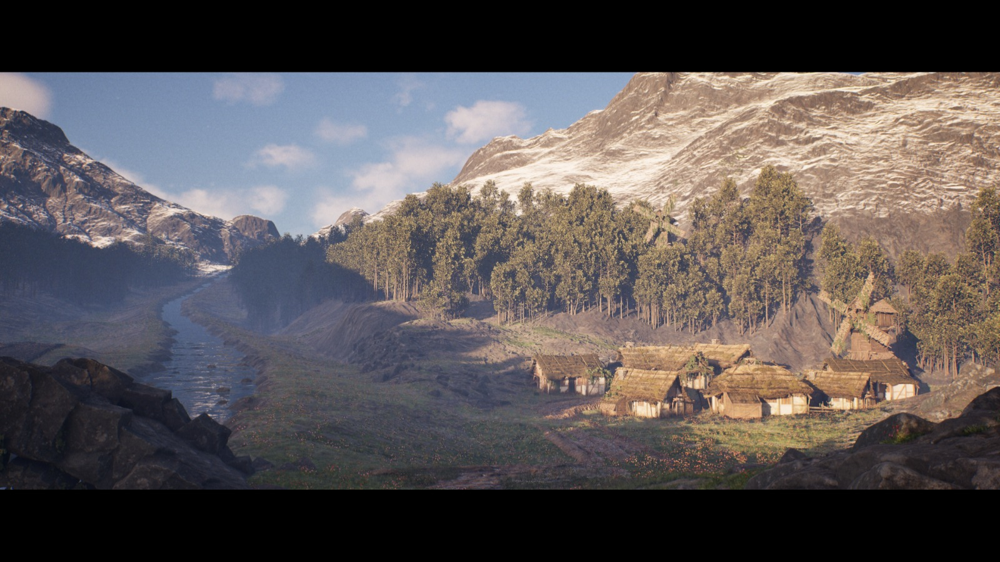

# A-Ruined-KingDom

Progetto in **Unreal Engine 5** che esplora le potenzialità del motore grafico attraverso la realizzazione di un **video in stile trailer**, renderizzato con **Movie Render Queue** a qualità massima.

L’ambientazione rappresenta un mondo medievale in una valle: **castello medievale**, **villaggio rurale decadente**, **fiume** e **ponte** come elementi principali di composizione e narrativa ambientale.

---

## Anteprima

---

## Concept & ispirazioni

L’idea principale era sviluppare un ambiente medievale credibile e suggestivo, prendendo come ispirazione:

- le **valli del Trentino** (morfologia, vegetazione, atmosfera)
- il mondo de **Il Signore degli Anelli** (tono epico, mood e scala)

---

## Tecnologie e strumenti

Per ottenere render ad alta qualità sono stati utilizzati:

- **Nanite** – gestione avanzata della geometria ad alta densità
- **Lumen** – illuminazione globale dinamica e riflessioni
- **Movie Render Queue** – rendering finale del trailer a massima qualità
- **CJSuperSkyBasic** (plugin esterno) – gestione del tempo e del cielo dinamico

---

## Contenuti della scena

Elementi principali presenti nel mondo:

- Castello medievale (landmark dominante)
- Villaggio rurale con aspetto vissuto e decadente
- Fiume come asse naturale della valle
- Ponte come punto di transizione e guida visiva
- Dettagli ambientali per atmosfera e realismo

---

## Media

- Trailer: consegnato sul form del corso
- Screenshot: `Media/*.jpg` / `Media/*.png`

---

## Credits

- **Engine:** Unreal Engine 5
- **Plugin:** CJSuperSkyBasic
- Asset / materiali / suoni: *(aggiungi qui le fonti, se presenti)*

---

## Licenza

Scegli una licenza in base a come vuoi distribuire il progetto:

- **MIT / Apache-2.0** se vuoi massima libertà
- **All rights reserved** se contiene asset non redistribuibili (es. progetto scolastico/portfolio)